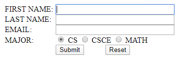

CPSC 349 Midterm
For our second part of our midterm we needed to code to create the following, which contains labels,text fields, radio buttons, and buttons. Require all text fields to be filled in. Ensure the first name field has the focus when the form is opened.
